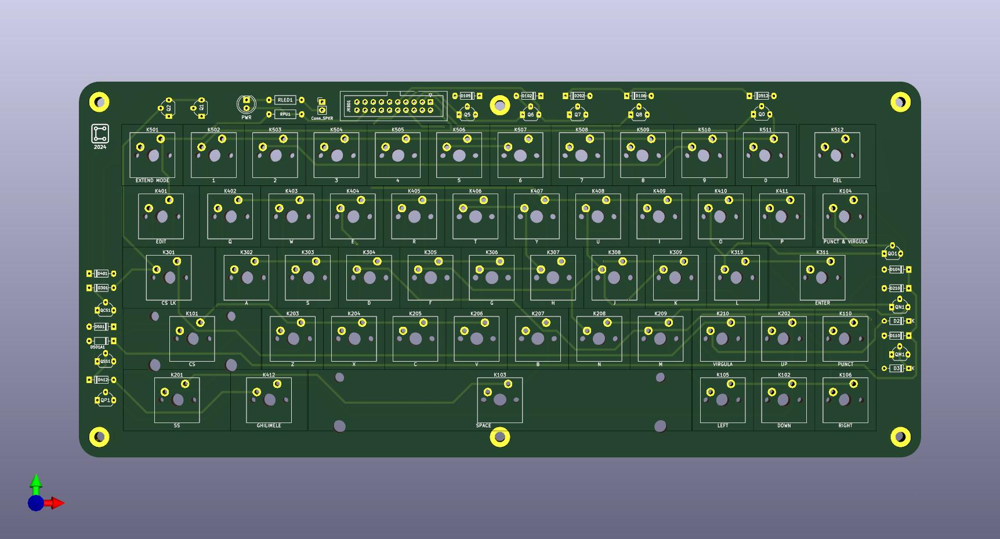

# Tastatură Custom pentru Turbo Spectrum

Acesta este un proiect open-source pentru o tastatură mecanică compatibilă cu computerul românesc **Turbo Spectrum**: https://cobrasov.org/
Tastatura a fost proiectată pentru a fi ușor de construit, utilizând componente accesibile.

Instructiuni pentru librariile de butoane folosite:
Open the KiCad "Plugin and Content Manager" (referred to as "PCM" from now on) and click on "Manage". Add a new entry with the plus sign and paste
https://raw.githubusercontent.com/ebastler/ebastler-KiCad-repository/main/repository.json
From this point on you will have "ebastler KiCad repository" in your drop-down selection, and it will allow you to install (and update) marbastlib through PCM - easy and hassle-free.

